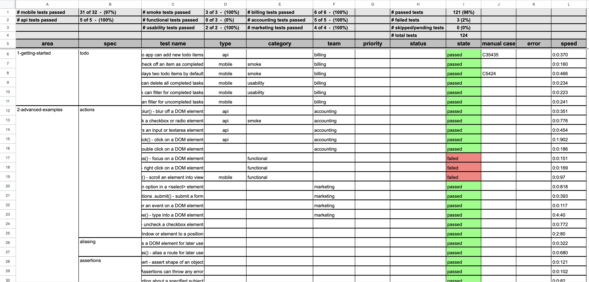

# Cypress & Playwright + Sheets = Enhanced Reporting and Organization

Our package bridges Cypress and Playwright test runs with Google Sheets or CSV, streamlining test result integration and boosting team collaboration. It not only provides immediate insights into automation project health but also leads a paradigm shift in organizational methods, promoting clearer coordination and efficiency. Note: Cypress is a registered trademark of Cypress.io, Playwright is a registered trademark of Microsoft Corporation, and Google Sheets is a registered trademark of Google Inc. This application is not officially endorsed or certified by Playwright, Microsoft Corporation, Google Inc., or Cypress.io.

## Table of Contents

1. [Sheets Daily Report Sample](#daily-report-sample)
2. [Sheets Monthly Summary Sample](#monthly-summary-sample)
3. [CSV Monthly Summary Sample](#csv-monthly-summary-sample)
4. [Setup Guide](#setup-guide)

   - [Cypress](#cypress)
   - [Playwright](#playwright)

5. [Generating a Report](#generating-a-report)

   - [In Sheets](#to-generate-reports-in-sheets)
   - [In CSV](#to-generate-reports-in-csv-format-only)
   - [Quick Command Reference](#quick-command-reference)

6. [Minimum Configuration](#minimum-configuration)
7. [Enhanced Configuration](#enhanced-configuration)

   - [Column: Team Name](#column-team-name)
   - [Column: Test Target](#column-test-target)
   - [Column: Test Purpose](#column-test-purpose)
   - [Column: Testrail Id](#column-testrail-id)
   - ['The Works'](#the-works)

8. [Github CI/CD](#github-cicd)
9. [Demo Branch](#demo-branch)

### Sheets Daily Report Sample



### Sheets Monthly Summary Sample


### CSV Daily Report Sample


## Setup Guide

#### Cypress

Before you begin, ensure you have the following packages and authentication:

- **Mochawesome and Mochawesome Merge:** Install these for Cypress test report generation: `npm install --save-dev mochawesome mochawesome-merge`.
- **Google Spreadsheet ID:** Find this in your sheet's URL and store it in an environment variable.
- **Service Account Credentials for Google Sheets:** Follow the detailed guide from `node-google-spreadsheet` they have a great document describing Google Service Accounts [node-google-spreadshee: Google Service Account](https://theoephraim.github.io/node-google-spreadsheet/#/guides/authentication?id=authentication-methods)
  to set up and safely store your credentials, updating `shadowReportConfig.*` (`js`, or `ts`) with the path to these credentials. Use `.gitignore` to secure your credentials within your project.
- **Create a configuration file:** In the root of your Cypress project, create a configuration file named: `shadowReportConfig.*` (`js`, or `ts`).

```
module.exports = {
  googleSpreadsheetId: 'v544j5h4h456v6n',
  googleKeyFilePath: 'googleCredentials.json',
  testData: 'cypress/results/output.json',
};
```

#### Recommended `package.json` Scripts

To ensure tests and reports are processed correctly, configure your `package.json` similarly to the following example:

```
  "scripts": {
    "cypress:prerun": "rm -rf cypress/results",
    "cypress:run": "npm run cypress:prerun && cypress run --headless --reporter mochawesome --reporter-options reportDir=cypress/results,overwrite=false,html=false,json=true",
    "postcypress:run": "npm run report:merge",
    "report:merge": "mochawesome-merge cypress/results/*.json > cypress/results/output.json && npm run report:generate",
    "report:generate": "qa-shadow-report",
    "cypress-test": "npm run cypress:run"
  },
```

In this example, running `npm cypress-test` will

- `cypress:prerun` delete all previous test run data.
- `cypress:run` run all Cypress tests and add each test result to a `results` folder, in JSON format.
- `postcypress:run` call `report:merge`.
- `report:merge` merge individual test results into one large JSON object.
- `report:generate` extract data from the merged test result JSON object and place the pertinent data into a sheet.

Adjust these scripts as needed for your project's requirements.

#### Playwright

Before you begin, ensure you have the following packages and authentication:

- **Google Spreadsheet ID:** Find this in your sheet's URL and store it in an environment variable.
- **Service Account Credentials for Google Sheets:** Follow the detailed guide from `node-google-spreadsheet` they have a great document describing Google Service Accounts [node-google-spreadshee: Google Service Account](https://theoephraim.github.io/node-google-spreadsheet/#/guides/authentication?id=authentication-methods)
  to set up and safely store your credentials, updating `shadowReportConfig.*` (`js`, or `ts`) with the path to these credentials. Use `.gitignore` to secure your credentials within your project.
- **Create a configuration file:** In the root of your Playwright project, create a configuration file named: `shadowReportConfig.*` (`js`, or `ts`).

```
module.exports = {
  googleSpreadsheetId: 'v544j5h4h456v6n',
  googleKeyFilePath: 'googleCredentials.json',
  testData: 'playwright/test-results/output.json',
};
```

#### Recommended `package.json` Scripts

To ensure tests and reports are processed correctly, configure your `package.json` similarly to the following example:

```
  "scripts": {
    "playwright:prerun": "rm -rf playwright/test-results",
    "playwright:run": "npm run playwright:prerun && playwright test --output=playwright/test-results --reporter=json,overwrite=false,html=false,json=true",
    "report:generate": "qa-shadow-report --framework=playwright",
    "playwright-test": "npm run playwright:run && npm run report:generate"
  },
```

In this example, running npm run playwright-test will:

- `playwright:prerun`: Delete all previous Playwright test run data by removing the playwright/test-results folder.
- `playwright:run`: Run all Playwright tests, storing each result in the test-results folder in JSON format.
- `report:generate`: Generate a report based on the Playwright test results using qa-shadow-report.
- `playwright-test`: Combine playwright:run and report:generate to execute the entire process in one step, running the tests and then generating the report.
  Make sure that your qa-shadow-report command works as expected with Playwright data, and adjust any paths or arguments to fit your specific project's setup.

## Generating a Report

### To Generate Reports In Sheets

    All commands require that test report data is present, in this example, the report data is generated by the testing framework.

- **To run the standard global functionality**

  - Run the command `npx qa-shadow-report`.
  - This command processes the data from the test results and create a detailed report.
  - A new sheet Tab will be creted with the current days title e.g `Mar 24, 2024`, to which this detailed report will be written.
  - If tabs exist on the Sheet for the previous month e.g. current month is April and Sheet Tabs exist for `Mar 24, 2024`, `Mar 25, 2024`, then a monthly summary will be generated with that previous months data `Summary Mar 2024`.
  - The report will fail if JSON test result data is not present.
  - Duplicate Sheet Tabs are not allowed, to create a duplicte tab, use the flag `--duplicate`.

- **To run the daily report only**

  - Run `npx qa-shadow-report todays-report`.
  - Ensure JSON data is present from framework test results output.
  - Duplicate Sheet Tabs are not allowed, to create a duplicte tab, use the flag `--duplicate`.
  - This command will bypass the task of generating a monthly summary.

- **To run the monthly summary report only**

  - Run `npx qa-shadow-report monthly-summary`.
  - Ensure daily reports from the previous month are present, otherwise no summary will be generated.
  - Duplicate Sheet Tabs are not allowed, to create a duplicte tab, use the flag `--duplicate`.
  - This command will bypass the task of generating a daily report.

### To Generate Reports In CSV format only

- **To run the daily report**

  - Use the base commands with the optional flag `--csv`
    - `npx qa-shadow-report --csv`
    - `npx qa-shadow-report todays-report --csv`
  - Ensure JSON data is present from Cypress test results output.
  - A detailed summary will be downloaded into the Cypress Downloads folder `[framework]/downloads`
  - A monthly summary in CSV format is not currently supported.

### To Generate Duplicates

- Use the base commands with the optional flag `--duplicate`
  - `npx qa-shadow-report --duplicate`
  - `npx qa-shadow-report todays-report --duplicate`
  - Monthly summary dupliactes must be created directly, using the command `qa-shadow-report monthly-summary`.

### Quick Command Reference

- `qa-shadow-report` or `qasr`- Generates a monthly and daily report in sheets, if none exist.
- `qa-shadow-report todays-report` - Generates todays reportin sheets, if none exist.
- `qa-shadow-report monthly-summary` - Generates a monthly summary in sheets, if none exist.
- `--csv` - Outputs the test results in cypress/downloads folder in csv format, if none exist.
- `--duplicate` - Allows duplicate daily reports to be created.
- `--help` - Outputs a summary of available commands and their usage.

### Minimum Configuration

Include the following in your `shadowReportConfig.*` (`.js`, or`.ts`) file for basic functionality

- `googleSpreadsheetId`: This is the Sheet ID for your Google Sheets project (found in the URL of your Google Sheet).
- `googleKeyFilePath`: Path to your Google service account credentials.
- `testData`: Path to your test results JSON file

```
module.exports = {
  googleSpreadsheetId: 'v544j5h4h456v6n',
  googleKeyFilePath: 'googleCredentials.json',
  testData: '[framework]/results/output.json',
};
```

### Enhanced Configuration

#### Column: Team Name

If you have team names or labels indicating ownership of a test or code feature, you need to specify them to ensure visibility on the report sheet. Add them to your `shadowReportConfig.*` (`.js`, or`.ts`) file:

```
module.exports = {
  teamNames: [
    'oregano',
    'spoofer',
    'juniper',
    'occaecati',
    'wilkins',
    'canonicus',
  ],
  googleSpreadsheetId: 'v544j5h4h456v6n',
  googleKeyFilePath: 'googleCredentials.json',
  testData: '[framework]/results/output.json',
};

```

The Team Name column aggregates and displays data based on the team names you define. Include the team name within square brackets in the describe block string to identify the team responsible for the feature code. For instance, `[Windsor]` is used as the team name in this example:

```
describe('[Windsor] Unit test our math functions', () => {
  context('math', () => {
    it('can add numbers [C2452][smoke]', () => {
      expect(add(1, 2)).to.eq(3)
    })

    it('can subtract numbers [C24534][smoke]', () => {
      expect(subtract(5, 12)).to.eq(-7)
    })

    it('can divide numbers [C2460]', () => {
      expect(divide(27, 9)).to.eq(3)
    })

    it('can multiply numbers [C2461]', () => {
      expect(multiply(5, 4)).to.eq(20)
    })
  })
})
```

This configuration allows for a more organized and comprehensive report, showcasing test ownership and facilitating team-specific analysis. If you do not specify Team Names, there will be no metrics reported regarding Teams.

### Column: Test Target

The Test Target column compiles and categorizes data based on predefined categories. To ensure visibility on the report sheet. Add them to your `shadowReportConfig.*` (`.js`, or`.ts`) file. If you do not specify a list of Test Targets, the reporting software will use the default list, and will only compile metrics based on the default list of: `["api", "ui", "unit", "integration", "endToEnd", "performance", "security", "database", "accessibility", "mobile"]`.

```
module.exports = {
      teamNames: ['oregano'],
      testTargets: [
        'api',
        'ui',
        'unit',
        'integration',
        'endToEnd',
        'performance',
        'security',
        'database',
        'accessibility',
        'mobile',
      ],
      googleSpreadsheetId: 'v544j5h4h456v6n',
      googleKeyFilePath: 'googleCredentials.json',
      testData: '[framework]/results/output.json',
};
```

To incorporate a Test Target into your [framework] report, it's essential, and highly recommended, to integrate the Target Type into your [framework] file structure. This practice enhances organizational clarity within your team. For instance, in this example, 'api' is added after the e2e directory:

`[framework]/api/1-getting-started/todo.cy.js`

Similarly, you can structure your files for other types, such as UI or Performance:

`[framework]/ui/1-getting-started/todo.cy.js`

`[framework]/performance/1-getting-started/todo.cy.js`

This method of file organization facilitates easy identification and categorization of tests based on their target type, thereby streamlining the reporting and analysis process.

### Column: Test Purpose

The Test Purpose column compiles data to represent the specific purpose of each test, based on predefined categories. To ensure visibility on the report sheet. Add them to your `shadowReportConfig.*` (`.js`, or`.ts`) file. If you do not specify a list of Test Purposes, the reporting software will use the default list, and will only compile metrics based on the default list of: `["smoke", "regression", "sanity", "exploratory", "functional", "load", "stress", "usability", "compatibility", "alpha", "beta"]`.

```
module.exports = {
      teamNames: ['oregano'],
      testTargets: ['mobile'],
      testPurposes: [
        'smoke',
        'regression',
        'sanity',
        'exploratory',
        'functional',
        'load',
        'stress',
        'usability',
        'compatibility',
        'alpha',
        'beta',
      ],
      googleSpreadsheetId: 'v544j5h4h456v6n',
      googleKeyFilePath: 'googleCredentials.json',
      testData: 'cyp[framework]ress/results/output.json',
    };
```

To indicate the purpose of a test within your [framework] suite, add the Test Purpose in square brackets at the end of the string in the `it` block. This annotation specifies the intended coverage of the test. For example, in this snippet, `[smoke]` and `[usability]` are used to denote Test Purposes:

```
describe('[Windsor] Unit test our math functions', () => {
  context('math', () => {
    it('can add numbers [C2452][smoke]', () => {
      expect(add(1, 2)).to.eq(3)
    })

    it('can subtract numbers [C24534][smoke]', () => {
      expect(subtract(5, 12)).to.eq(-7)
    })

    it('can divide numbers [C2460] [usability]', () => {
      expect(divide(27, 9)).to.eq(3)
    })

    it('can multiply numbers [C2461]', () => {
      expect(multiply(5, 4)).to.eq(20)
    })
  })
})
```

This approach not only categorizes your tests effectively but also adds clarity to the specific objectives they aim to achieve, thereby enhancing the insightfulness of your test reporting.

### Column: Testrail Id

The TestRail ID column is designed to extract data from the test report output and align it with the associated TestRail ID in the TestRail ID column. Within the it block string in your [framework] tests, include the TestRail ID in square brackets at the end of the string. This notation specifies the TestRail ID linked to each particular test. For instance, `[C2452]` and `[C24534]` are examples of TestRail IDs used in this context:

```
describe('[Windsor] Unit test our math functions', () => {
  context('math', () => {
    it('can add numbers [C2452][smoke]', () => {
      expect(add(1, 2)).to.eq(3)
    })

    it('can subtract numbers [C24534][smoke]', () => {
      expect(subtract(5, 12)).to.eq(-7)
    })

    it('can divide numbers [C2460] [usability]', () => {
      expect(divide(27, 9)).to.eq(3)
    })

    it('can multiply numbers [C2461]', () => {
      expect(multiply(5, 4)).to.eq(20)
    })
  })
})
```

This method ensures that each test is accurately linked to its corresponding TestRail ID, facilitating a more detailed and organized approach to test tracking, reporting, and auditing.

### 'The Works'

When specifying your Team Names, Test Targets, and Test Purposes, your `shadowReportConfig.*` (`.js`, or`.ts`) can look like this

```
module.exports = {
      teamNames: [
        'oregano',
        'wilkins',
        'canonicus',
      ],
      testTargets: [
        'api',
        'ui',
        'accessibility',
        'mobile',
      ],
      testPurposes: [
        'smoke',
        'compatibility',
        'alpha',
        'beta',
      ],
      googleSpreadsheetId: 'v544j5h4h456v6n',
      googleKeyFilePath: 'googleCredentials.json',
      testData: '[framework]/results/output.json',
    };
```

### Github CI/CD

This package is best suited for automated nightly runs, enabling teams to efficiently monitor project status and collaborate on test results every morning.

**Integrating Google Sheets Credentials with GitHub Actions:**

For seamless integration in GitHub Actions, as required for manual package operation, the Google Sheets credentials need to be appropriately configured. Given the length constraints of GitHub secrets, it may be necessary to compact the Google Sheets key using GPG encryption.

**Steps for Secure Key Management**

1. **Local Encryption of the Secret Key**

   - **Generate a GPG Key Pair:** If not already available, generate a new GPG key pair using the command `gpg --gen-key`.
   - **Encrypt the Secret File:** For a secret file named `google-key.json`, encrypt it by executing `gpg --output google-key.json.gpg --symmetric --cipher-algo AES256 google-key.json`.

2. **Storing Encrypted Secrets in GitHub**

   - **Repository Storage:** Include the encrypted file (`google-key.json.gpg`) in the repository.
   - **Creating a GitHub Secret:** Generate a GitHub secret named `GPG_PASSPHRASE` containing the passphrase used for file encryption.

3. **Decrypting the Secret in GitHub Actions**
   - **Workflow Modification:** Incorporate steps in your GitHub Actions workflow to decrypt the secret file using the stored passphrase. The modifications should align with your project's encryption setup.

**Note:** A suitable GitHub Action configuration is required for this process to function correctly:

```
name: Nightly Cypress Test and Report

on:
  schedule:
    # Schedule to run at 00:00 UTC (You can adjust the time as needed)
    - cron: '0 0 * * *'

jobs:
  cypress-test-and-report:
    runs-on: ubuntu-latest

    steps:
    - name: Check out repository
      uses: actions/checkout@v2

    - name: Set up Node.js
      uses: actions/setup-node@v2
      with:
        node-version: '14' # Specify the Node.js version

    - name: Install GPG
      run: sudo apt-get install -y gpg

    - name: Decrypt Google Sheets Key
      run: |
        echo "${{ secrets.GPG_PASSPHRASE }}" | gpg --passphrase-fd 0 --output google-key.json --decrypt google-key.json.gpg

    - name: Install dependencies
      run: npm install

    - name: Run Cypress Tests and Generate Report
      run: |
        npm run cypress:prerun
        npm run cypress:run
        npm run postcypress:run
        npm run report:generate
```

Additional Notes:

- **Security:** Be cautious with the passphrase and the encrypted file. If someone gains access to both, they can decrypt your secret.
- **GPG Version:** Ensure that the GPG version you use locally for encryption is compatible with the version installed in the GitHub Actions runner.
- **File Paths:** Adjust file paths in the script according to where you store the encrypted file and where the decrypted file is needed.

### Demo Branch

For those who want to see `qa-shadow-report` in action before integrating it into their projects, we have set up a `demo branch` in the repository. This branch includes a fully configured setup where you can run and observe the report generation process.

#### How to Use the Demo

1. **Switch to the Demo Branch:** Navigate to our repository and switch to the branch named `demo`.
2. **Follow the Setup Instructions:** Ensure you meet the prerequisites and follow the setup steps outlined in the [Setup Guide](#setup-guide).
3. **Install Dependencies:**

   - **For General Use:**
     If you're looking to use the plugin without modifying its code, you can easily install the published package from npm. Execute the following commands at the root of your project: `cd [framework]-example && npm install qa-shadow-report && npm install`

     This will install the `qa-shadow-report` package from npm along with any other required dependencies.

   - **For Advanced Users (Local Development):**
     If you are contributing to the `qa-shadow-report` code and need to test your changes within `[framework]-example`, you can use a locally linked version of the package. Run this command at the root of the project: `npm link && cd [framework]-example && npm install && npm link qa-shadow-report`

     This sequence of commands first creates a local link to your development version of `qa-shadow-report`, then sets up `[framework]-example` to use this local version, and finally installs any other dependencies.

4. **Run the Tests:** While in the `[framework]-example` folder, use the [framework] command to run [framework] tests and generate reports.
5. **Observe the Results:** Check the generated reports in the specified Google Sheet or CSV file.

The demo branch is an excellent resource for understanding how `qa-shadow-report` functions in a real-world scenario. Feel free to explore and modify the demo setup to test different configurations and features.

## Copyright

© 2024 Peter Souza. All rights reserved. Users are granted the freedom to use this code according to their needs and preferences. Note: Cypress is a registered trademark of Cypress.io, Playwright is a registered trademark of Microsoft Corporation, and Google Sheets is a registered trademark of Google Inc. This application is not officially endorsed or certified by Playwright, Microsoft Corporation, Google Inc., or Cypress.io.
