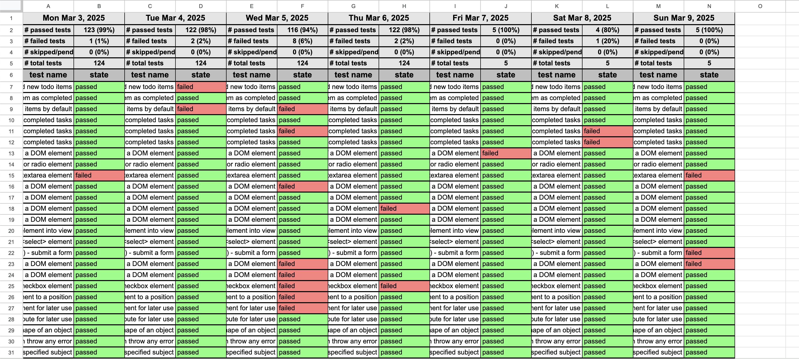

# Cypress & Playwright Reporting: Seamless Integration with Google Sheets and CSV

Our package bridges Cypress and Playwright test runs with Google Sheets or CSV, streamlining test result integration and boosting team collaboration. It not only provides immediate insights into automation project health but also leads a paradigm shift in organizational methods, promoting clearer coordination and efficiency.

**Note:** Cypress is a registered trademark of Cypress.io, Playwright is a registered trademark of Microsoft Corporation, and Google Sheets is a registered trademark of Google Inc. This application is not officially endorsed or certified by Playwright, Microsoft Corporation, Google Inc., or Cypress.io.

## Table of Contents

1. [Installation](#installation)
2. [Quick Start](#quick-start)
   - [Generate Reports in CSV Format](#generate-reports-in-csv-format)
3. [Samples](#samples)
   - [Daily Report in Sheets](#daily-report-in-sheets)
   - [Weekly Summary in Sheets](#weekly-summary-in-sheets)
   - [Monthly Summary in Sheets](#monthly-summary-in-sheets)
   - [Daily Report in CSV](#daily-report-in-csv)
4. [Sheets Setup Guide](#sheets-setup-guide)
   - [Cypress](#cypress)
   - [Playwright](#playwright)
5. [Sheets Enhanced Configuration](#sheets-enhanced-configuration)
   - [Column: Team](#column-team)
   - [Column: Type](#column-type)
   - [Column: Category](#column-category)
   - [Column: Manual Case](#column-manual-case)
   - ['The Works'](#the-works)
6. [Cypress-Grep Integration](#cypressgrep-integration)
7. [CI/CD](#cicd)
   - [GitHub](#github-actions-example)
   - [GitLab](#gitlab-ci-example)
   - [AWS](#aws-codebuild-example)
8. [Demo Branch](#demo-branch)

## Installation

### qa-shadow-report Setup Guide

After installing `qa-shadow-report` using the command:

    npm i qa-shadow-report

you will then need to run the command:

    npx qasr-setup

this initiates a series of `Yes` or `No` questions to guide you through setting up the tool for your testing framework and package manager. You may choose to exit the setup at any time by entering `EXIT`, which is not recommended. If you exit setup, you will then need to restart using the command `npx qasr-setup`

**Note:** The commands in this guide assume the use of `npm/npx`. If you prefer to use `yarn`, replace `npm/npx` with `yarn` where appropriate.

## Quick Start

### Generate Reports in CSV Format

- Ensure test result data is present in your framework's test results output folder, in the form of JSON. This output should be present after you finish `qasr-setup` AND run your test suite. test results will usually be found in `results/output.json`.

- A detailed CSV will be compiled and generated in the `[framework]/downloads` folder.

- Only daily summmaries are available for CSV, monthly summary reports are not currently supported in CSV format.

Use either command to generate reports using either **NPX** or **NPM scripts** with a framework of **Cypress** or **Playwright** and the optional flag `--csv`. These commands will generate a CSV report, and initiate setup if you havent yet run the qa-shadow-report setup.

- **Using NPX:**
  Run one of the following commands:

      npx qa-shadow-report [framework] --csv

  Or, the more verbose

      npx qa-shadow-report [framework] todays-report --csv

- **Using NPM Scripts:**

  Add to your `package.json` scripts:

  ```json
  // package.json
  "scripts": {
    "report:csv": "qa-shadow-report [framework] --csv",
    "report:csv": "qa-shadow-report [framework] todays-report --csv", // more verbose
  }
  ```

  Then run:

  ```
  npm run report:csv
  ```

## Samples

### Daily Report in Sheets

The Daily Summary features high-level metrics such as a test quantity and percentage pass rate across multiple categories. Test details are organized into columns that include: the feature area, spec title, test name, test type, test category, team identifiers, test priority, test status, test state, manual case id, error details, and speed of execution (in mm:ss:mmm format).

This structured format enables teams to quickly assess test outcomes on demand, with an example entry in the feature `area` '1-getting-started', in the 'todo' `spec`, the `test name` example to-do app can add new todo items', classified as `type` 'api', with no `category`, 'billing `team` is responsible, `status` 'passing' with a `speed` of '370 milliseconds'. The team may want to type in a `status` of 'billing team adding test category' with a `priority` of 'low'.


### Weekly Summary in Sheets

The Weekly Summary is optional, and it provides a short term summary of the previous weeks `passed`, `failed`, `skipped`, and `total` test results. This summary is a great tool for teams who have weekly meetings to discuss their progress/status/gameplan


### Monthly Summary in Sheets

The Monthly Summary provides a brief overview of historical test execution results, giving long term visibility into `passed`, `failed`, `skipped`, and `total` test results for the previous month, allowing trends to emerge.


### Daily Report in CSV

The Daily Report in CSV format delivers hardcoded snapshot of high-level test metrics, mirroring the formulaic insights provided by the Daily Summary in Sheets: feature area, spec title, test name, test type, test category, team identifiers, priority, status, state, manual case ID, error details, and speed of execution (in mm:ss:mmm format). Unlike the Sheets version, which leverages formulas for dynamic calculations, the CSV report contains hardcoded values, ensuring compatibility with static file formats while maintaining the same depth of analysis.


## Sheets Setup Guide

### Cypress

Before you begin, ensure you have the following packages and authentication. You can run the command `npx qasr-setup`, which initiates a series of Yes or No questions to guide you through setting up the tool for your testing framework and package manager:

- **Mochawesome and Mochawesome Merge:** Usually installed by the setup wizard, these are recommended for Cypress test report generation:

`npm install --save-dev mochawesome mochawesome-merge`

- **Google Spreadsheet URL:** Place the sheet's URL directly in an environment variable: `https://docs.google.com/spreadsheets/d/1Y8tQWmo3oSB3zIlr1mySs/edit?gid=160#gid=19160`.
- **Service Account Credentials for Google Sheets:** Follow the detailed guide from `node-google-spreadsheet` they have a great document describing Google Service Accounts [node-google-spreadshee: Google Service Account](https://theoephraim.github.io/node-google-spreadsheet/#/guides/authentication?id=authentication-methods)
  to set up and safely store your credentials. update `shadowReportConfig.*` (`js`, or `ts`) with the path to these credentials. Use `.gitignore` to secure your credentials within your project. Allow your service account to Edit the Google Sheet by sharing the google sheet with the service account emial address as an Editor.
- **qa-shadow-report configuration file:** Usually installed by the setup wizard in the root of your Cypress project, named: `shadowReportConfig.*` (`js`, or `ts`).

  - `teamNames`: An array of identifiers representing different teams within your organization that may use or contribute to the testing process.

  - `testTypes`: Specifies the types of tests included in your project, such as API tests or UI tests, to help organize and filter test executions.
  - `testCategories`: Defines the categories of tests your project includes, such as smoke tests for quick checks or sanity tests for verifying vital features after builds.
  - `googleSpreadsheetUrl`: The URL of your Google Sheet. This is used to integrate and sync test result data.
  - `googleKeyFilePath`: The file path to your Google service account credentials, which are required to authenticate and interact with Google Sheets API.
  - `testData`: The file path to where your test results in JSON format are stored, typically generated by Cypress or another testing framework.
  - `csvDownloadsPath`: The directory path where the generated CSV files will be saved. This is useful for users who prefer to download and review test results in a CSV format.
  - `weeklySummaryStartDay`: This is where you choose the day that summary week begins, and will include the next 7 days. Uncommenting this line will activate the weekly summary, while keeping it commented will leave it inactive.

  ```js
  // shadowReportConfig.js
  module.exports = {
    teamNames: ['unicorns', 'robots'],
    testTypes: ['api', 'ui'],
    testCategories: ['smoke', 'sanity'],
    googleSpreadsheetUrl:
      'https://docs.google.com/spreadsheets/d/1Y8tQWmo3oSB3zIlr1mySs/edit?gid=160#gid=19160',
    googleKeyFilePath: './googleCredentials.json',
    testData: './cypress/results/output.json',
    csvDownloadsPath: './downloads',
    weeklySummaryStartDay: 'Monday',
  };
  ```

#### Recommended `package.json` Scripts

To ensure tests and reports are processed correctly, configure your `package.json` similarly to the following example:

```json
// package.json
  "scripts": {
    "cypress:prerun": "rm -rf cypress/results",
    "cypress:run": "npm run cypress:prerun && cypress run --headless --reporter mochawesome --reporter-options reportDir=cypress/results,overwrite=false,html=false,json=true --quiet  || true",
    "postcypress:run": "npm run report:merge",
    "report:merge": "mochawesome-merge cypress/results/*.json > cypress/results/output.json && npm run report:generate",
    "report:generate": "qa-shadow-report cypress",
    "cypress-test": "npm run cypress:run"
  },
```

In this example, running `npm run cypress-test` will

- `cypress:prerun` Delete all previous test run data.

- `cypress:run` Run all Cypress tests and add each test result to a `results` folder, in JSON format.
- `postcypress:run` Call `report:merge`.
- `report:merge` Merge individual test results into one large JSON object.
- `report:generate`: Generate a report based on the Cypress test results using qa-shadow-report.

Adjust these scripts as needed for your project's requirements.

### Playwright

Before you begin, ensure you have the following packages and authentication, you can run the command `npx qasr-setup` which initiates a couple of Yes or No questions to guide you through setting up the tool for your testing framework and package manager:

- **Google Spreadsheet URL:** Place the sheet's URL directly in an environment variable: `https://docs.google.com/spreadsheets/d/1Y8tQWmo3oSB3zIlr1mySs/edit?gid=160#gid=19160`.
- **Service Account Credentials for Google Sheets:** Follow the detailed guide from `node-google-spreadsheet` they have a great document describing Google Service Accounts [node-google-spreadshee: Google Service Account](https://theoephraim.github.io/node-google-spreadsheet/#/guides/authentication?id=authentication-methods)
  to set up and safely store your credentials. update `shadowReportConfig.*` (`js`, or `ts`) with the path to these credentials. Use `.gitignore` to secure your credentials within your project. Allow your service account to Edit the Google Sheet by sharing the google sheet with the service account emial address as an Editor.
- **Playwright Configuration**: In the `playwright.config.js` file, specify the reporter like this:

  ```js
  // playwright.config.js
  reporter: [['json', { outputFile: './test-results/output.json' }]];
  ```

- **qa-shadow-report Configuration File:** `shadowReportConfig.*` (`js`, or `ts`) Can be installed by the setup wizard in the root of your project, you can run the command `npx qasr-setup` which initiates a series of Yes or No questions to guide you through setting up the tool for your testing framework and package manager.

  - `teamNames`: An array of identifiers representing different teams within your organization that may use or contribute to the testing process.

  - `testTypes`: Specifies the types of tests included in your project, such as API tests or UI tests, to help organize and filter test executions.
  - `testCategories`: Defines the categories of tests your project includes, such as smoke tests for quick checks or sanity tests for verifying vital features after builds.
  - `googleSpreadsheetUrl`: The URL of your Google Sheet. This is used to integrate and sync test result data.
  - `googleKeyFilePath`: The file path to your Google service account credentials, which are required to authenticate and interact with Google Sheets API.
  - `testData`: The file path to where your test results in JSON format are stored, typically generated by Cypress or another testing framework.
  - `csvDownloadsPath`: The directory path where the generated CSV files will be saved. This is useful for users who prefer to download and review test results in a CSV format.
  - `weeklySummaryStartDay`: This is where you choose the day that summary week begins, and will include the next 7 days. Uncommenting this line will activate the weekly summary, while keeping it commented will leave it inactive.

  ```js
  // shadowReportConfig.js
  module.exports = {
    teamNames: ['unicorns', 'robots'],
    testTypes: ['api', 'ui'],
    testCategories: ['smoke', 'sanity'],
    googleSpreadsheetUrl:
      'https://docs.google.com/spreadsheets/d/1Y8tQWmo3oSB3zIlr1mySs/edit?gid=160#gid=19160',
    googleKeyFilePath: './googleCredentials.json',
    testData: './cypress/results/output.json',
    csvDownloadsPath: './downloads',
    weeklySummaryStartDay: 'Monday',
  };
  ```

#### Recommended `package.json` Scripts

To ensure tests and reports are processed correctly, configure your `package.json` similarly to the following example:

```json
// package.josn
  "scripts": {
    "playwright:prerun": "rm -rf test-results",
    "playwright:run": "npm run playwright:prerun && playwright test || true",
    "report:generate": "qa-shadow-report playwright",
    "playwright-test": "npm run playwright:run && npm run report:generate"
  },
```

In this example, running npm run playwright-test will:

- `playwright:prerun`: Delete all previous Playwright test run data by removing the playwright/test-results folder.

- `playwright:run`: Run all Playwright tests, storing each result in the test-results folder in JSON format.
- `report:generate`: Generate a report based on the Playwright test results using qa-shadow-report.
- `playwright-test`: Combine playwright:run and report:generate to execute the entire process in one step, running the tests and then generating the report.
  Make sure that your qa-shadow-report command works as expected with Playwright data, and adjust any paths or arguments to fit your specific project's setup.

### To Generate Reports In Sheets

All commands require that test suite result data is present, in this example, the test suite data is generated by the testing framework, either Cypress or Playwright.

- **To run the root `qa-shadow-report` functionality**

  - **Using NPX:**

    ```
    npx qa-shadow-report [framework]
    ```

  - **Using NPM Scripts:**

    Add to your `package.json`:

    ```json
    // package.json
    "scripts": {
      "report:generate": "npx qa-shadow-report [framework]"
    }
    ```

    Then run:

    ```
    npm run report:generate
    ```

  - This command processes the data from the test results and create a detailed report.
  - A new Sheet Tab will be created with the current day's title (e.g., `Mar 24, 2024`), to which this detailed report will be written.
  - If the Sheet has Tabs for the previous month (e.g., current month is April and sheet tabs exist for `Mar 24, 2024`, `Mar 25, 2024`), then a monthly summary will be generated with that previous month's data (`Summary Mar 2024`).
  - The report will fail if test result data is not present in JSON format.
  - Duplicate Sheet Tabs are not created by defualt, to create a duplicate Tab, use the flag `--duplicate`.

- **To run the daily report only**

  - Run `npx qa-shadow-report [framework] todays-report`.
  - Ensure JSON data is present from framework test results output.
  - Duplicate Sheet Tabs are not created by defualt, to create a duplicte Tab, use the flag `--duplicate`.

- **To run the weekly summary report only**

  - Run `npx qa-shadow-report [framework] weekly-summary`.
  - Ensure daily reports from the previous week are present, otherwise no summary will be generated.
  - Duplicate Sheet Tabs are not created by defualt, to create a duplicate Tab, use the flag `--duplicate`.

- **To run the monthly summary report only**

  - Run `npx qa-shadow-report [framework] monthly-summary`.
  - Ensure daily reports from the previous month are present, otherwise no summary will be generated.
  - Duplicate Sheet Tabs are not created by defualt, to create a duplicate Tab, use the flag `--duplicate`.

### To Generate Duplicates

- Use the base commands with the optional flag `--duplicate`
  - `npx qa-shadow-report [framework] --duplicate`
  - `npx qa-shadow-report [framework] todays-report --duplicate`
  - Monthly summary dupliactes must be created directly, using the command `npx qa-shadow-report [framework] monthly-summary`.

### Quick Command Reference

- `npx qa-shadow-report [framework]` or `npx qasr [framework]` - Generates a monthly and daily report in Sheets, if none exist.

- `npx qa-shadow-report [framework] todays-report` - Generates todays report in Sheets, if none exist.
- `npx qa-shadow-report [framework] weekly-summary` - Generates a weekly summary in Sheets, if none exist.
- `npx qa-shadow-report [framework] monthly-summary` - Generates a monthly summary in Sheets, if none exist.
- `npx qasr-setup` - Initiates the setup process for either Cypress or Playwright.
- `--csv` - Outputs the test results in cypress/downloads folder in csv format, if none exist.
- `--duplicate` - Allows duplicate daily reports to be created.
- `--help` - Outputs a summary of available commands and their usage.

### Sheets Enhanced Configuration

#### Column: Team

If you have team names or labels indicating ownership of a test or code feature, you need to specify them to ensure visibility on the report sheet. Add them to your `shadowReportConfig.*` (`.js`, or`.ts`) file:

```js
// shdowReportConfig.js
module.exports = {
  teamNames: [
    'oregano',
    'spoofer',
    'juniper',
    'occaecati',
    'wilkins',
    'canonicus',
  ],
  googleSpreadsheetUrl:
    'https://docs.google.com/spreadsheets/d/1Y8tQWmo3oSB3zIlr1mySs/edit?gid=160#gid=19160',
  googleKeyFilePath: './googleCredentials.json',
  testData: './[framework]/results/output.json',
  csvDownloadsPath: './downloads',
  weeklySummaryStartDay: 'Monday',
};
```

The **Team Name** column aggregates and displays data based on the team names you define. Include the team name within square brackets in the describe/context/it block string to identify the team responsible for the feature code. For instance, `[Windsor]` is used as the team name in this example:

```js
describe('[Windsor] Unit test our math functions', () => {
  context('math', () => {
    it('can add numbers [C2452][smoke]', () => {
      expect(add(1, 2)).to.eq(3);
    });

    it('can subtract numbers [C24534][smoke]', () => {
      expect(subtract(5, 12)).to.eq(-7);
    });

    it('can divide numbers [C2460]', () => {
      expect(divide(27, 9)).to.eq(3);
    });

    it('can multiply numbers [C2461]', () => {
      expect(multiply(5, 4)).to.eq(20);
    });
  });
});
```

This configuration allows for a more organized and comprehensive report, showcasing test ownership and facilitating team-specific analysis. If you do not specify Team Names, there will be no metrics reported regarding Teams.

### Column: Type

The **Type** column compiles and categorizes data based on predefined categories. To ensure visibility on the report sheet. Add them to your `shadowReportConfig.*` (`.js`, or`.ts`) file. If you do not specify a list of Test Targets, the reporting software will use the default list, and will only compile metrics based on the default list of: `["api", "ui", "unit", "integration", "endToEnd", "performance", "security", "database", "accessibility", "mobile"]`.

```js
// shadowReportConfig.js
module.exports = {
  teamNames: ['oregano'],
  testTypes: [
    'api',
    'ui',
    'unit',
    'integration',
    'endToEnd',
    'performance',
    'security',
    'database',
    'accessibility',
    'mobile',
  ],
  googleSpreadsheetUrl:
    'https://docs.google.com/spreadsheets/d/1Y8tQWmo3oSB3zIlr1mySs/edit?gid=160#gid=19160',
  googleKeyFilePath: './googleCredentials.json',
  testData: './[framework]/results/output.json',
  csvDownloadsPath: './downloads',
  weeklySummaryStartDay: 'Monday',
};
```

To incorporate a test Tpye into your [framework] report, it's essential, and highly recommended, to integrate the test Type into your [framework] file structure. This practice enhances organizational clarity within your team. For instance, in this example, 'api' is added after the e2e directory:

`[framework]/e2e/api/1-getting-started/todo.cy.js`

Similarly, you can structure your files for other types, such as UI or Performance:

`[framework]/ui/1-getting-started/todo.cy.js`

`[framework]/performance/1-getting-started/todo.cy.js`

This method of file organization facilitates easy identification and categorization of tests based on their target type, thereby streamlining the reporting and analysis process.

### Column: Category

The **Category** column compiles data to represent the specific purpose of each test, based on predefined categories. To ensure visibility on the report sheet. Add them to your `shadowReportConfig.*` (`.js`, or`.ts`) file. If you do not specify a list of Categories, the reporting software will use the default list, and will only compile metrics based on the default list of: `["smoke", "regression", "sanity", "exploratory", "functional", "load", "stress", "usability", "compatibility", "alpha", "beta"]`.

```js
// shadowReportConfig.js
module.exports = {
  teamNames: ['oregano'],
  testTypes: ['mobile'],
  testCategories: [
    'smoke',
    'regression',
    'sanity',
    'exploratory',
    'functional',
    'load',
    'stress',
    'usability',
    'compatibility',
    'alpha',
    'beta',
  ],
  googleSpreadsheetUrl:
    'https://docs.google.com/spreadsheets/d/1Y8tQWmo3oSB3zIlr1mySs/edit?gid=160#gid=19160',
  googleKeyFilePath: './googleCredentials.json',
  testData: './[framework]/results/output.json',
  csvDownloadsPath: './downloads',
  weeklySummaryStartDay: 'Monday',
};
```

To indicate the purpose of a test within your [framework] suite, add the Test Purpose in square brackets in the describe/context/it block, usually at the end of the string. This annotation specifies the intended coverage of the test. For example, in this snippet, `[smoke]` and `[usability]` are used to denote Test Purposes:

```js
describe('[Windsor] Unit test our math functions', () => {
  context('math', () => {
    it('can add numbers [C2452][smoke]', () => {
      expect(add(1, 2)).to.eq(3);
    });

    it('can subtract numbers [C24534][smoke]', () => {
      expect(subtract(5, 12)).to.eq(-7);
    });

    it('can divide numbers [C2460] [usability]', () => {
      expect(divide(27, 9)).to.eq(3);
    });

    it('can multiply numbers [C2461]', () => {
      expect(multiply(5, 4)).to.eq(20);
    });
  });
});
```

This approach not only categorizes your tests effectively but also adds clarity to the specific objectives they aim to achieve, thereby enhancing the insightfulness of your test reporting.

### Column: Manual Case

The **Manual Case** column is designed to display the Manual Case ID associated to the automated test. Within the describe/context/it block string in your [framework] tests, include the Manual Case in square brackets at the end of the string. This notation specifies the Manual Case linked to each particular test. For instance, [C2452] and [C24534] are examples of manual cases used in this context. You can format identifiers using a prefix of letters (or symbols like # or -), followed by one or more numbers, as in [DEV-345], [TC-34535], and [#356363]. Make sure the identifier is enclosed within square brackets.

```js
describe('[Windsor] Unit test our math functions', () => {
  context('math', () => {
    it('can add numbers [C2452][smoke]', () => {
      expect(add(1, 2)).to.eq(3);
    });

    it('can subtract numbers [C24534][smoke]', () => {
      expect(subtract(5, 12)).to.eq(-7);
    });

    it('can divide numbers [C2460] [usability]', () => {
      expect(divide(27, 9)).to.eq(3);
    });

    it('can multiply numbers [C2461]', () => {
      expect(multiply(5, 4)).to.eq(20);
    });
  });
});
```

This method ensures that each test is accurately linked to its corresponding Manual Case ID, facilitating a more detailed and organized approach to test tracking, reporting, and auditing.

### 'The Works'

When specifying your Team Names, Test Targets, and Test Purposes, your `shadowReportConfig.*` (`.js`, or`.ts`) can look like this

```js
// shadowReportConfig.js
module.exports = {
  teamNames: ['oregano', 'wilkins', 'canonicus'],
  testTypes: ['api', 'ui', 'accessibility', 'mobile'],
  testCategories: ['smoke', 'compatibility', 'alpha', 'beta'],
  googleSpreadsheetUrl:
    'https://docs.google.com/spreadsheets/d/1Y8tQWmo3oSB3zIlr1mySs/edit?gid=160#gid=19160',
  googleKeyFilePath: './googleCredentials.json',
  testData: './[framework]/results/output.json',
  csvDownloadsPath: './downloads',
  weeklySummaryStartDay: 'Monday',
};
```

## cypress/grep Integration

To enhance your testing workflow and leverage the team name, test type, and test category annotations you've included in your test titles, we recommend integrating the [`cypress-grep`](https://www.npmjs.com/package/@cypress/grep) plugin.

### Benefits of Using cypress/grep

- **Selective Test Execution:** Run only the tests that match certain patterns, such as `[smoke]`, `[api]`, or `[Windsor]`, improving efficiency.

- **Enhanced Filtering:** Easily filter tests by team, type, or category directly from the command line or via environment variables.

### Usage

You can use `cypress/grep` to run tests that match specific patterns:

- **Run all smoke tests:**

`npx cypress run --env grep=[smoke],grepFilterSpecs=true`

- **Run all tests for the 'Windsor' team:**

`npx cypress run --env grep=[Windsor],grepFilterSpecs=true`

- **Run all smoke tests for team Windsor:**

`npx cypress run --env grep=[Windsor];[smoke],grepFilterSpecs=true`

- **cypress/grep `Tags` Feature**

The `cypress/grep` package has a Tags feature, which allows you to add an Object after the test description, like this: `it('verifies X = 2', { tags: 'smoke' }, () => {`. This format does not break the functionality of `qa-shadow-report`, but it is not fully supported either. Specifically, `qa-shadow-report` will not parse the object or include its tags in the generated report. Only the text in the test description itself will be parsed and added to the report, meaning that any tags added as objects will be ignored by `qa-shadow-report`.

By integrating `cypress/grep`, you can run subsets of tests based on your annotations, which aligns perfectly with your team's naming conventions and test categorization.

### CI/CD

This package is best suited for automated nightly runs, enabling teams to efficiently monitor project status and collaborate on test results every morning.

**Integrating Google Sheets Credentials with CI/CD:**

For seamless integration into CI/CD pipelines, the Google Sheets credentials need to be appropriately configured. Given the length constraints of most CI/CD environment variables, it may be necessary to compact the Google Sheets key using GPG encryption.

**Steps for Secure Key Management**

1. **Local Encryption of the Secret Key**

   - **Generate a GPG Key Pair:** If not already available, generate a new GPG key pair using the command `gpg --gen-key`.
   - **Encrypt the Secret File:** For a secret file named `google-key.json`, encrypt it by executing `gpg --output google-key.json.gpg --symmetric --cipher-algo AES256 google-key.json`.

2. **Storing Encrypted Secrets in Repository/CI Environmen**

   - **Repository Storage:** Include the encrypted file (`google-key.json.gpg`) in the repository.
   - **Creating a CI/CD Environment Variable:** Generate a secret named `GPG_PASSPHRASE` containing the passphrase used for file encryption.

3. **Decrypting the Secret in CI/CD**
   - **Workflow Modification:** Incorporate steps in your CI/CD workflow to decrypt the secret file using the stored passphrase. The modifications should align with your project's encryption setup.

#### GitHub Actions Example:

```yaml
name: Nightly regression and report

on:
  schedule:
    - cron: '0 1 * * *' # Runs daily at 1 AM UTC
  push:
    branches:
      - main

jobs:
  qa-regression-and-report:
    runs-on: ubuntu-latest

    steps:
      - name: Checkout code
        uses: actions/checkout@v4

      - name: Set up Node.js
        uses: actions/setup-node@v4
        with:
          node-version: '21'

      - name: Install GPG
        run: sudo apt-get install -y gpg

      - name: Decrypt Google Sheets Key
        env:
          GPG_PASSPHRASE: ${{ secrets.GPG_PASSPHRASE }}
        run: |
          echo "$GPG_PASSPHRASE" | gpg --batch --yes --passphrase-fd 0 --output googleCredentials.json --decrypt googleCredentials.json.gpg

      - name: Set Google Key File Path
        run: echo "GOOGLE_KEY_FILE_PATH=$(pwd)/googleCredentials.json" >> $GITHUB_ENV

      - name: Install dependencies
        run: npm install

      - name: Run QA regression tests
        run: npm run cypress:nightly
```

#### GitLab CI Example:

(Note: To schedule nightly runs, set up a pipeline schedule in your GitLab project settings.)

```yaml
stages:
  - test

nightly_regression:
  stage: test
  image: cypress/browsers:22.12.0
  allow_failure: true
  before_script:
    - apt-get update && apt-get install -y gnupg
    - git checkout $CI_COMMIT_REF_NAME
  script:
    - echo "$GPG_PASSPHRASE" | gpg --batch --yes --passphrase-fd 0 --output googleCredentials.json --decrypt googleCredentials.json.gpg
    - export GOOGLE_KEY_FILE_PATH=$(pwd)/googleCredentials.json
    - npm install
    - npm run cypress:nightly
  only:
    - main
```

#### AWS CodeBuild Example:

For AWS CodeBuild, you can set up a comparable configuration using a `buildspec.yml` file:

```yaml
version: 0.2

phases:
  install:
    runtime-versions:
      nodejs: 21
    commands:
      - apt-get update && apt-get install -y gnupg
  pre_build:
    commands:
      - echo "Decrypting Google Sheets Key..."
      - echo $GPG_PASSPHRASE | gpg --batch --yes --passphrase-fd 0 --output googleCredentials.json --decrypt googleCredentials.json.gpg
      - export GOOGLE_KEY_FILE_PATH=$(pwd)/googleCredentials.json
  build:
    commands:
      - npm install
      - npm run cypress:nightly
```

Additional Notes:

- **Security:** Be cautious with the passphrase and the encrypted file. If someone gains access to both, they can decrypt your secret.
- **GPG Version:** Ensure that the GPG version you use locally for encryption is compatible with the version installed in the CI/CD environment.
- **File Paths:** Adjust file paths in the script according to where you store the encrypted file and where the decrypted file is needed.

### Demo Branch

For those who want to see `qa-shadow-report` in action before integrating it into their projects, we have set up a `demo branch` in the repository. This branch includes a fully configured setup where you can run and observe the report generation process.

#### How to Use the Demo

1. **Switch to the Demo Branch:** Navigate to our repository and switch to the branch named `demo`.
2. **Follow the Setup Instructions:** Ensure you meet the prerequisites and follow the setup steps outlined in [Installation](#installation).
3. **Install Dependencies:**

   - **For General Use:**
     If you're looking to use the plugin without modifying its code, you can easily install the published package from npm. Execute the following commands at the root of your project: `cd [framework]-example && npm install qa-shadow-report && npm install`

     This will install the `qa-shadow-report` package from npm along with any other required dependencies.

   - **For Advanced Users (Local Development):**
     If you are contributing to the `qa-shadow-report` code and need to test your changes within `[framework]-example`, you can use a locally linked version of the package. Run this command at the root of the project: `npm link && cd [framework]-example && npm install && npm link qa-shadow-report`

     This sequence of commands first creates a local link to your development version of `qa-shadow-report`, then sets up `[framework]-example` to use this local version, and finally installs any other dependencies.

4. **Run the Tests:** While in the `[framework]-example` folder, use the [framework] command to run [framework] tests and generate reports.
5. **Observe the Results:** Check the generated reports in the specified Google Sheet or CSV file.

The demo branch is an excellent resource for understanding how `qa-shadow-report` functions in a real-world scenario. Feel free to explore and modify the demo setup to test different configurations and features.

## Copyright

© 2025 Peter Souza. All rights reserved. Users are granted the freedom to use this code according to their needs and preferences.

**Note:** Cypress is a registered trademark of Cypress.io, Playwright is a registered trademark of Microsoft Corporation, and Google Sheets is a registered trademark of Google Inc. This application is not officially endorsed or certified by Playwright, Microsoft Corporation, Google Inc., or Cypress.io.
